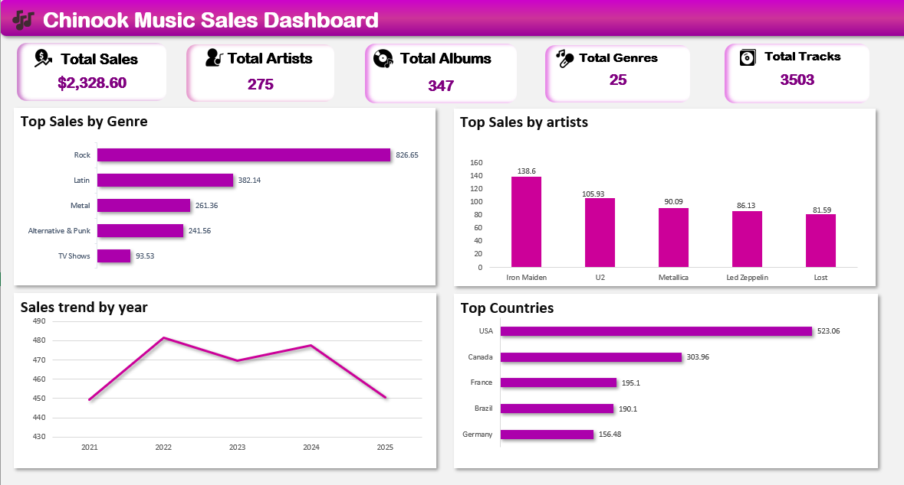

# 🎵 Chinook Music Sales Analysis

### **MySQL + Excel Data Visualization Project**

This project analyzes the Chinook Music Store Database using MySQL for data extraction and Excel for dashboard creation. The goal was to extract key business insights using SQL and present the findings in an interactive dashboard format.

---

## 📘 Project Overview

The Chinook database represents a digital music store containing:

* Artists
* Albums
* Tracks
* Genres
* Customers
* Invoices & Invoice Items

I used MySQL to extract and aggregate the sales data, then imported the cleaned dataset into Excel, where I built the dashboard.

---

## 📁 Dashboard Preview

---

## 🔍 Key Insights

* **Top Genre:** Rock is the dominant sales genre.
* **Leading Artist:** Iron Maiden generates the highest sales revenue among all artists.
* **Top Market:** The USA is the most valuable market, followed by Canada.
* **Sales Trend:** Yearly sales show clear fluctuations and trends.

---

## 👤 Author

**Shahd Hussein**

[LinkedIn](https://www.linkedin.com/in/shahd-hussien)
